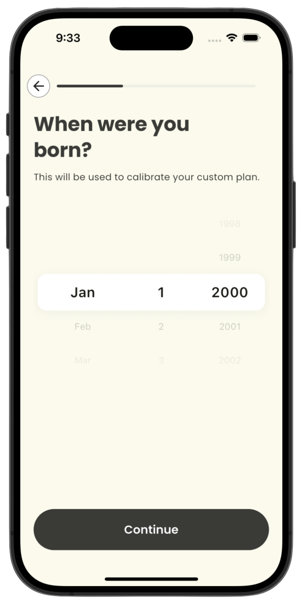
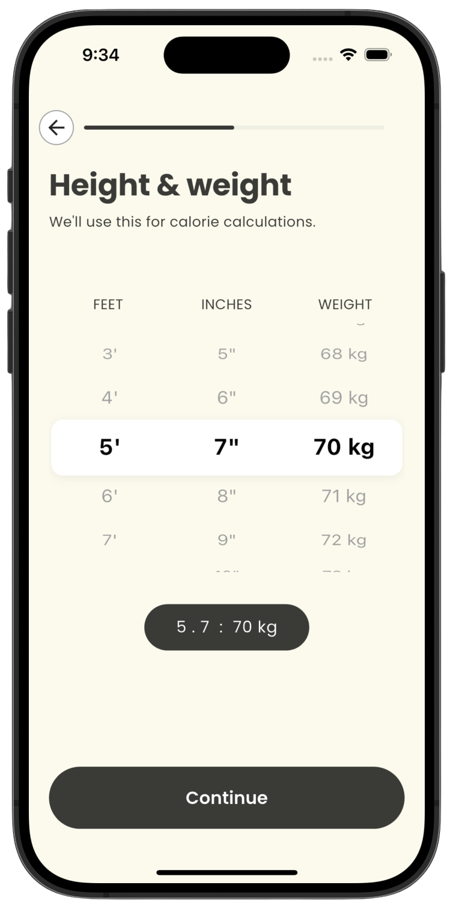

# 🥗 Cal AI — AI-Powered Calorie Tracker

> Track what you eat. Understand your nutrition. Powered by AI.

Cal AI is a Flutter mobile app that uses artificial intelligence to make calorie tracking effortless. Photograph your meal, and Cal AI instantly estimates nutritional information — no manual logging required.

---

## 📸 Screenshots

|                Home Screen                |                Meal Log                |                Nutrition Summary                |
| :---------------------------------------: | :------------------------------------: | :---------------------------------------------: |
|  |  |  |

> 💡 **Tip:** Drop your screenshots into a `/screenshots` folder and update the paths above.

---

## Features

- **AI Meal Recognition** — Snap a photo of your food, Cal AI identifies the food and estimates calories automatically.
- **Daily Calorie Dashboard** — See a clean summary of your daily intake vs. your personal calorie goal.
- **Macro Breakdown** — Track proteins, carbohydrates, and fats alongside total calories.
- **Meal History Log** — Browse a full history of logged meals with timestamps and nutritional details.
- **Personalized Goals** — Set custom calorie and macro targets based on your health goals.
- **Instant Nutritional Insights** — Get AI-generated tips and insights based on your eating patterns.
- **Lightweight & Fast** — Built with Flutter for a smooth, native experience on both Android and iOS.

---

## Getting Started

### Prerequisites

Make sure you have the following installed before running Cal AI:

- [Flutter SDK](https://docs.flutter.dev/get-started/install) (v3.0 or higher)
- [Dart](https://dart.dev/get-dart) (comes bundled with Flutter)

### Installation

1. **Clone the repository**

   ```bash
   git clone https://github.com/junaidjamel/cal_scanner
   ```

2. **Install dependencies**

   ```bash
   flutter pub get
   ```

3. **Set up environment variables**

   Go in `.env` file that is in the root directory & add your API keys:

   ```env
   GROQ_API_KEY=your_api_key_here
   ```

4. **Run the app**

   ```bash
   flutter run
   ```

---

## 🛠️ Tech Stack

| Layer            | Technology          |
| ---------------- | ------------------- |
| Framework        | Flutter (Dart)      |
| AI / NLP         | Grok AI             |
| State Management | _Cubit_             |
| Local Storage    | _Shared-Preference_ |
| UI Components    | Material Design 3   |

---

## 📁 Project Structure

```
cal-ai/
├── lib/
│   ├── main.dart           # App entry point
│   ├── screens/            # UI screens
│   ├── widgets/            # Reusable UI components
│   ├── models/             # Data models
│   ├── services/           # API & AI services
│   └── utils/              # Helper functions
├── assets/
│   └── images/             # App images & icons
├── test/                   # Unit & widget tests
├── pubspec.yaml            # Dependencies
└── README.md
```

---

## 🤝 Contributing

Contributions are welcome! To get started:

1. Fork the repository
2. Create a new branch: `git checkout -b feature/your-feature-name`
3. Commit your changes: `git commit -m 'Add some feature'`
4. Push to the branch: `git push origin feature/your-feature-name`
5. Open a Pull Request

---

## 📄 License

This project is licensed under the [MIT License](LICENSE).

---

## 👤 Author

**Junaid Jamel**

- Email: junaidsupercoder@gmail.com
- LinkedIn: [https://www.linkedin.com/in/junaid-jamel/](https://www.linkedin.com/in/junaid-jamel/)

---
